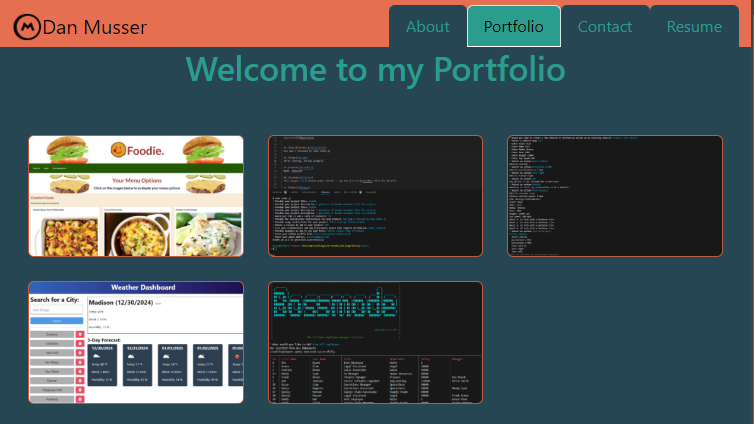

# ReactRhapsody
## Description
ReactRhapsody is a dynamic, single-page application portfolio designed to showcase the work of a skilled web developer. Built entirely in React, this portfolio highlights expertise in modern, component-driven design while maintaining scalability and adaptability for future projects.

The portfolio is structured to provide a seamless user experience, featuring interactive, reusable components that emphasize both functionality and design. Each project is presented with rich visuals and links to live pages or GitHub repositories, ensuring potential employers and collaborators can dive deeply into a developer's work.

### Key Features

* **Modular Component System:** Designed for efficiency, the portfolio uses a library of reusable components. These components make it easy to integrate new projects or sections with minimal development effort, showcasing the developer's ability to build scalable applications.
* **Responsive Design:** The portfolio is fully responsive, offering a polished experience on devices ranging from desktop computers to smartphones.
* **Animation and Interactivity:** Subtle animations, transitions, and hover effects create a modern, professional aesthetic while keeping the user engaged.
* **Scalability:** Future updates and additional features, such as a blog, testimonials, or downloadable resumes, are easy to implement due to the component-driven architecture.

ReactRhapsody serves as more than a portfolio; it is a living, breathing demonstration of a developer's ability to build elegant, efficient, and forward-thinking web applications.

## Table of Contents
 - [Installation](#installation)
 - [Usage](#usage)
 - [Credits](#credits)
 - [License](#license)
 - [Badges](#badges)
 - [Tests](#tests)
 - [Questions](#questions)

## [Installation](#installation)
  1. Clone this repo locally;
  2. Install dependencies by running `npm i` in your terminal from the root; and
  3. `npm run dev` to start localling and open `http://localhost:3000/` or applicable port.

  ## [Usage](#usage)
  Use this as a template to showcase your work. View live version here: [Dan Musser's Portfolio](https://reactrhapsody.netlify.app/).
  
  > 1. Review each page, About, Contact, Portfolio, and Resume;
  > 2. Update content to suit your specific needs; and
  > 3. Review `main.scss` file and update colors to your specific need.

  ### Application Screenshot
  

  ## [Credits](#credits)
  - [bootstrap](https://getbootstrap.com/)
  - [bootstrap-icons](https://icons.getbootstrap.com/)
  - [react](https://react.dev/)
  - [react-dom](https://www.npmjs.com/package/react-dom)
  - [react-router-dom](https://www.npmjs.com/package/react-router-dom)
  - [sass](https://sass-lang.com/)
  - In Dev
      - [eslint](https://eslint.org/)
      - [vite](https://vite.dev/)
  
  ## [License](#license)
  This project is licensed under the MIT - see the [LICENSE](LICENSE) file for details.

  ## [Badges](#badges)
  
  

  ## [Tests](#tests)
   Follow [Usage](#usage) and run application locally. Follow errors for tracing.
  
  ## [Questions](#questions)
  If you have any questions, please feel free to reach out to me at musserdn@gmail.com or visit my [GitHub Profile](https://github.com/musserdn/).